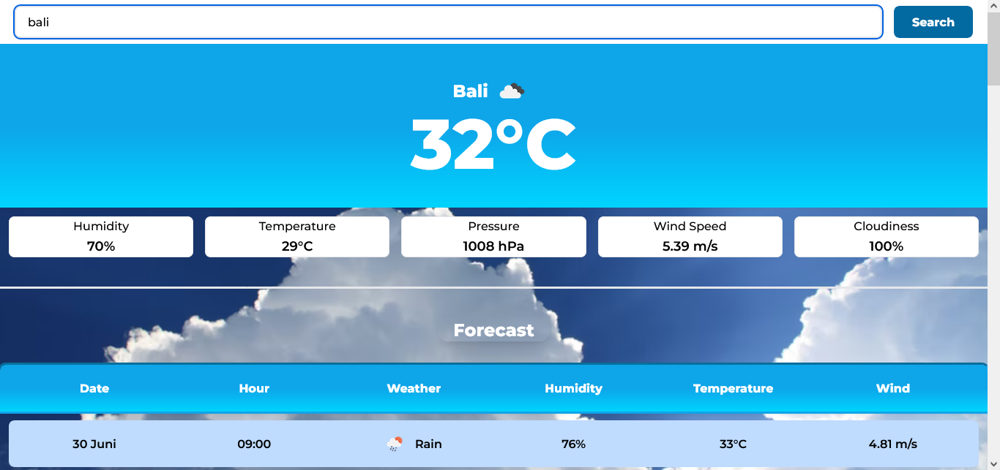
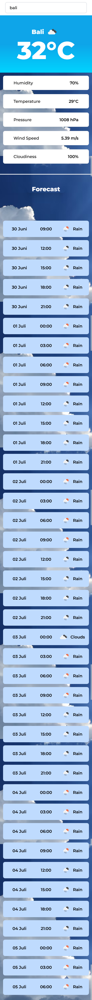

<h2>Simple Weather Application</h2>
<b><a href="https://weather-prediction-three.vercel.app/" target="_blank">LIVE SITE</a></b>

### Table of Contents

- [Overview](#overview)
- [Goals](#goals)
- [Features](#features)
- [Screenshot](#screenshots)
  - [Desktop](#desktop-preview)
  - [Mobile](#mobile-preview)
- [Built With](#built-with)
- [Related Links](#links)

## Overview

### Goals

> Create a simple Weather App by using open API

### Features

- [x] Check Weather based on **Current Location**
- [x] Check Weather by **Location Search**
- [x] Provide **Forecast** for the next day

### Screenshots

> #### Desktop Preview

> #### Mobile Preview

### Built With

### Links

> **[OpenWeather](https://openweathermap.org/api)**

> **[Live Site](https://weather-prediction-three.vercel.app/)**
